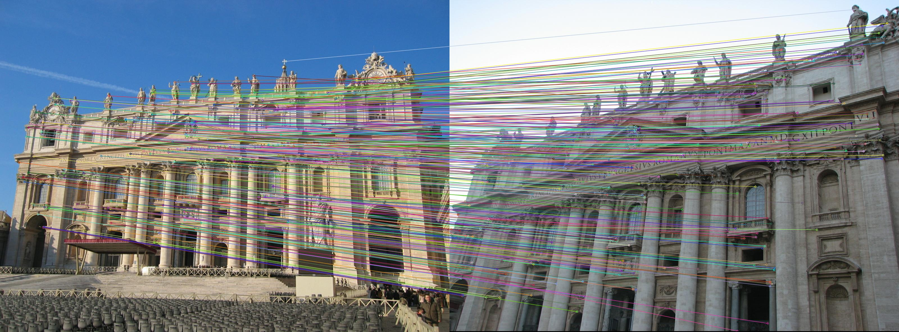
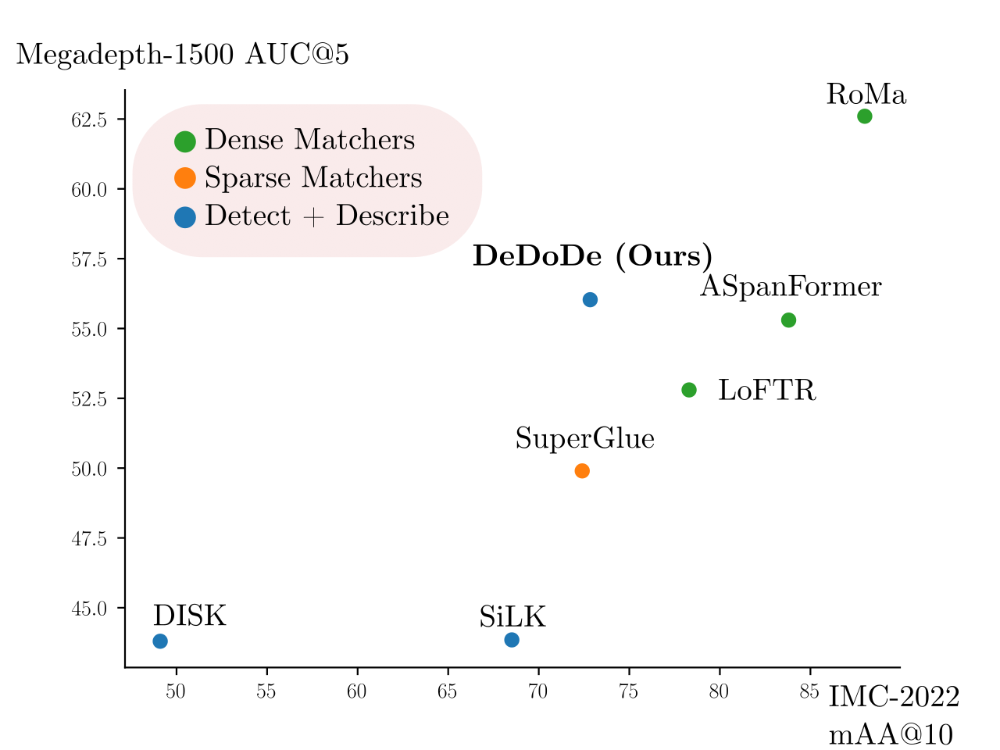
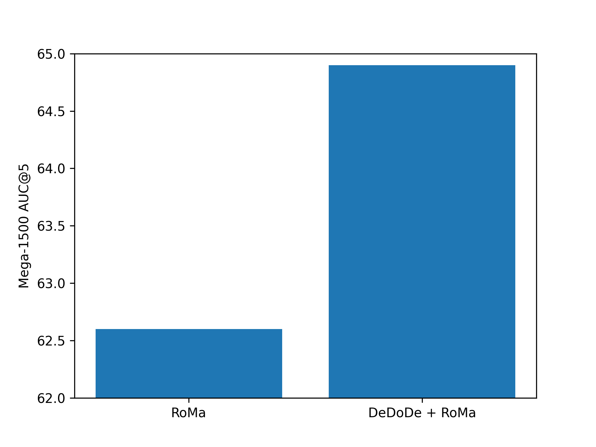

<p align="center">
  <h1 align="center"><ins>DeDoDe</ins> 🎶<br>Detect, Don't Describe --- Describe, Don't Detect <br> for Local Feature Matching</h1>
  <p align="center">
    <a href="https://scholar.google.com/citations?user=Ul-vMR0AAAAJ">Johan Edstedt</a>
    ·
    <a href="https://scholar.google.com/citations?user=FUE3Wd0AAAAJ">Georg Bökman</a>
    ·
    <a href="https://scholar.google.com/citations?user=6WRQpCQAAAAJ">Mårten Wadenbäck</a>
    ·
    <a href="https://scholar.google.com/citations?user=lkWfR08AAAAJ">Michael Felsberg</a>
  </p>
  <h2 align="center"><p>
    <a href="https://arxiv.org/abs/2308.08479" align="center">Paper</a> | 
    <a href="TODO" align="center">Project Page (TODO)</a>
  </p></h2>
  <div align="center"></div>
</p>
<p align="center">
    
    <br>
    <em>The DeDoDe detector learns to detect 3D consistent repeatable keypoints, which the DeDoDe descriptor learns to match. The result is a powerful decoupled local feature matcher.</em>
    <br>
        
        
    <br>
    <em>
    We experimentally find that DeDoDe significantly closes the performance gap between detector + descriptor models and fully-fledged matchers. The potential of DeDoDe is not limited to local feature matching, in fact we find that we can improve state-of-the-art matchers by incorporating DeDoDe keypoints.
    </em>
</p>

## How to Use DeDoDe?
Below we show how DeDoDe can be run, you can also check out the [demos](demo)
```python
from DeDoDe import dedode_detector_L, dedode_descriptor_B, dedode_descriptor_G
from DeDoDe.matchers.dual_softmax_matcher import DualSoftMaxMatcher

detector = dedode_detector_L(weights = torch.load("dedode_detector_L.pth"))
# Choose either a smaller descriptor,
descriptor = dedode_descriptor_B(weights = torch.load("dedode_descriptor_B.pth"))
# Or a larger one
descriptor = dedode_descriptor_G(weights = torch.load("dedode_descriptor_G.pth"), 
                                 dinov2_weights = None) # You can manually load dinov2 weights, or we'll pull from facebook

matcher = DualSoftMaxMatcher()

im_A_path = "assets/im_A.jpg"
im_B_path = "assets/im_B.jpg"
im_A = Image.open(im_A_path)
im_B = Image.open(im_B_path)
W_A, H_A = im_A.size
W_B, H_B = im_B.size


detections_A = detector.detect_from_path(im_A_path, num_keypoints = 10_000)
keypoints_A, P_A = detections_A["keypoints"], detections_A["confidence"]

detections_B = detector.detect_from_path(im_B_path, num_keypoints = 10_000)
keypoints_B, P_B = detections_B["keypoints"], detections_B["confidence"]

description_A = descriptor.describe_keypoints_from_path(im_A_path, keypoints_A)["descriptions"]
description_B = descriptor.describe_keypoints_from_path(im_B_path, keypoints_B)["descriptions"]

matches_A, matches_B, batch_ids = matcher.match(keypoints_A, description_A,
    keypoints_B, description_B,
    P_A = P_A, P_B = P_B,
    normalize = True, inv_temp=20, threshold = 0.1)#Increasing threshold -> fewer matches, fewer outliers

matches_A, matches_B = matcher.to_pixel_coords(matches_A, matches_B, H_A, W_A, H_B, W_B)

```
## Training DeDoDe

DISCLAMER: I've (Johan) not yet tested that the training scripts here reproduces our original results. This repo is very similar to the internal training repo, but there might be bugs introduced by refactoring etc. Let me know if you face any issues reproducing our results (or if you somehow get better results :D).

See [experiments](experiments) for the scripts to train DeDoDe. We trained on a single A100-40GB with a batchsize of 8. Note that you need to do the data prep first, see [data_prep](data_prep).

As usual, we require that you have the MegaDepth dataset already downloaded, and that you have the prepared scene info from [DKM](https://github.com/Parskatt/DKM/blob/main/docs/training.md).


## Pretrained Models

Right now you can find them here: https://github.com/Parskatt/DeDoDe/releases/tag/dedode_pretrained_models
Probably we'll add some autoloading in the near future.

## DeDoDe in Other Frameworks

- [fabio-sim/DeDoDe-ONNX-TensorRT](https://github.com/fabio-sim/DeDoDe-ONNX-TensorRT): Deploy DeDoDe with ONNX and TensorRT 🚀
- [Image Matching WebUI](https://github.com/Vincentqyw/image-matching-webui): a web GUI to easily compare different matchers, including DeDoDe
 🤗

## License
All code/models except DINOv2 (descriptor-G), are MIT license (do whatever you want). 
DINOv2 has a non-commercial license (see LICENSE_DINOv2).

## BibTeX

```txt
@article{edstedt2023dedode,
      title={{DeDoDe: Detect, Don't Describe -- Describe, Don't Detect for Local Feature Matching}}, 
      author={Johan Edstedt and Georg Bökman and Mårten Wadenbäck and Michael Felsberg},
      year={2023},
      eprint={2308.08479},
      archivePrefix={arXiv},
      primaryClass={cs.CV}
}
```
